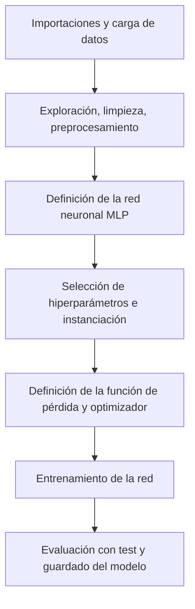

# Clasificador de Vinos 

Este proyecto tiene como objetivo poner en práctica los conocimientos adquiridos en una de las [clases del curso de deep learning del Qubit de Newton](https://youtu.be/EZJOxvMOZas?si=IO8x9ebSbQo0gpE2). Se trabaja con el dataset de vinos incluido en `scikit-learn`, utilizando una red neuronal para clasificar los vinos en tres clases distintas.

---

## Objetivos

- Poner en práctica el flujo de trabajo en proyectos de aprendizaje profundo 
- Reforzar conceptos básicos de redes neuronales en PyTorch.
- Explorar, limpiar y preprocesar un dataset real.
- Construir una red neuronal multicapa (MLP).
- Evaluar el desempeño del modelo y reflexionar sobre mejoras posibles.

---

## Dataset

Se utiliza el dataset `load_wine` de `scikit-learn`, que contiene atributos químicos de 178 vinos divididos en 3 clases.

- **Características**: 13 atributos como contenido de alcohol, intensidad del color, proline, etc.
- **Clases**: 3 tipos de vino (0, 1, 2)

> Algunas características como `proline`, `flavanoids` y `od280/od315` resultaron ser muy relevantes para la clasificación.

---

## Flujo de trabajo



---

## Preprocesamiento

- División de datos en train/test (80/20) y con `stratify=y`.

- Escalado de características con `StandardScaler`.

- Análisis exploratorio con histogramas, pairplots y matriz de correlación.

---

## Arquitectura del modelo 

```python 
class MLP(nn.Module):
    def __init__(self, input_size, hidden_size, output_size):
        super(MLP, self).__init__()
        self.model = nn.Sequential(
            nn.Linear(input_size, hidden_size),
            nn.ReLU(),
            nn.Linear(hidden_size, hidden_size),
            nn.ReLU(),
            nn.Linear(hidden_size, output_size)
        )

    def forward(self, x):
        return self.model(x)
```
### Características 
- Input size: 13
- Hidden size: 64 (x2 capas)
- Output size: 3
- Activación: ReLU

---

## Entrenamiento

- Épocas: 100
- Learning rate: 0.001
- Función de pérdida: `nn.CrossEntropyLoss()`
- Optimizador: Adam

El entrenamiento fue estable y las pérdidas bajaron suavemente minimizando el sobreajuste. 

---

## Resultados

- Precisión en test: **97.22%**
- Las clases fueron clasificadas correctamente en la mayoría de los casos.

--- 

## Mejoras posibles

- Analizar los errores de clasificación con una matriz de confusión.
- Probar una versión reducida del modelo usando solo las variables más relevantes.
- Ajustar los hiperparámetros y probar regularización.

## Contacto 
Puedes escribirme al email: [nbaezhuber@gmail.com](mailto:nbaezhuber@gmail.com)


