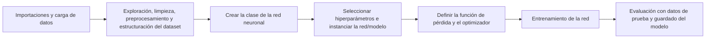
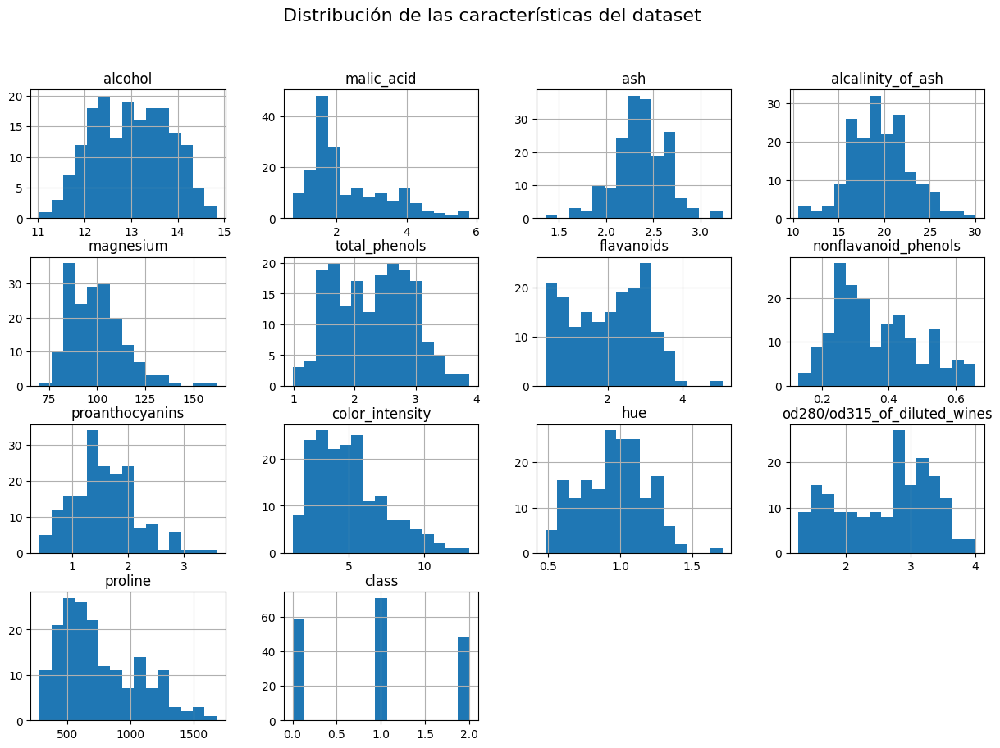
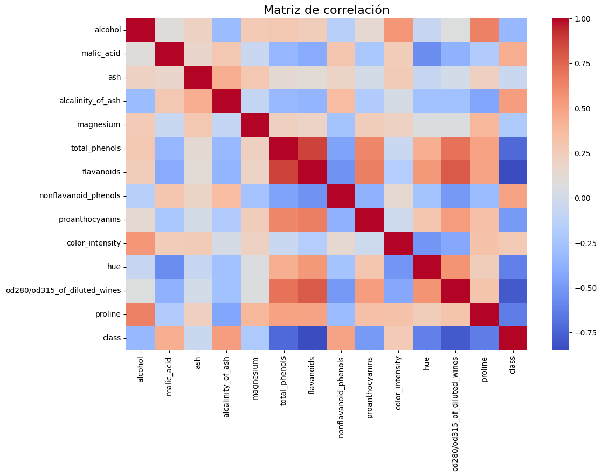
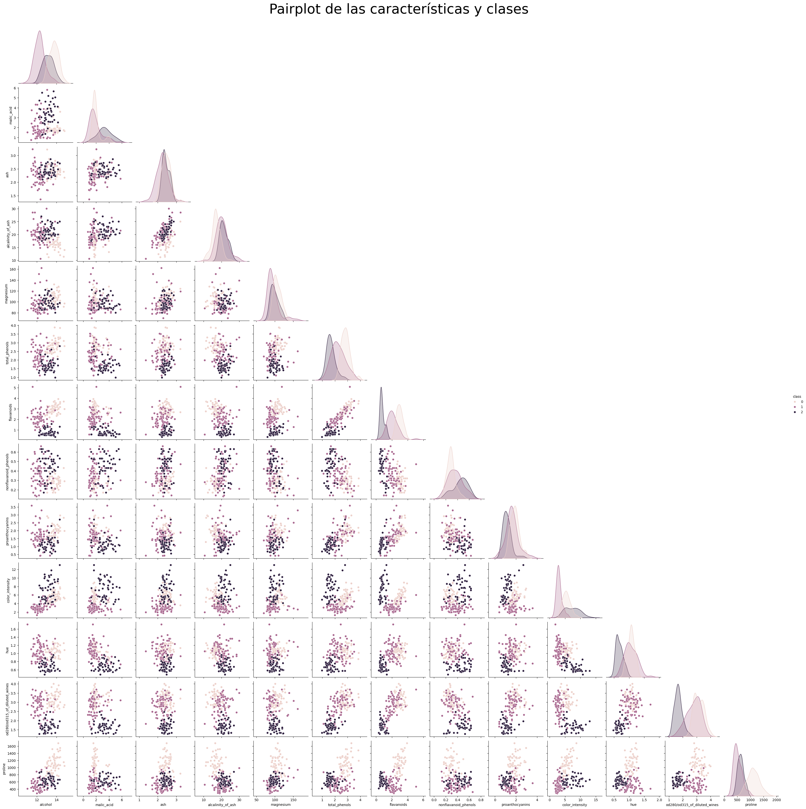
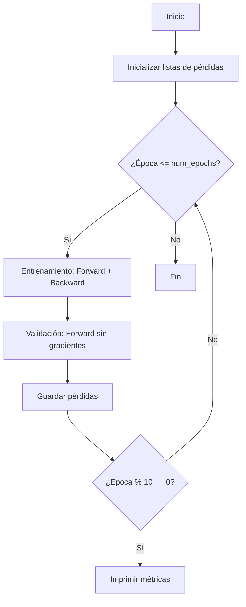
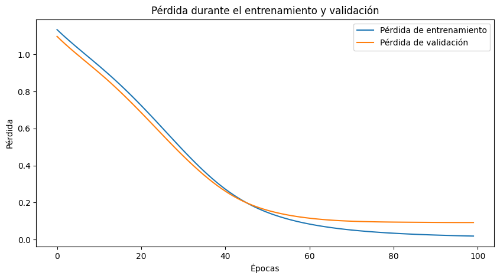
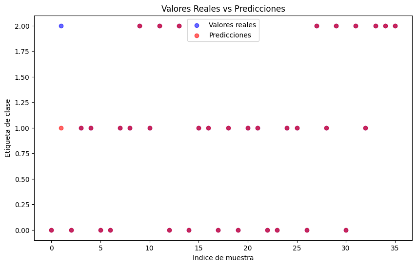

# Notas del proyecto 
El siguiente proyecto tiene como objetivo prácticar los conocimientos adquiridos en [una de las clases del curso de deep learning del Qubit de Newton](https://youtu.be/EZJOxvMOZas?si=IO8x9ebSbQo0gpE2)

Estas notas son apuntes personales del proyecto.

# Flujo de trabajo 
En este proyectos se siguió el siguiente flujo de trabajo:



## Importaciones y carga de datos

###  Librerias  

- `torch`: Librería principal de PyTorch.

- `torch.nn`: Módulo que contiene clases para construir redes neuronales (capas, funciones de activación, etc.).

- `torch.optim`: Algoritmos de optimización (SGD, Adam, etc.).

- `load_wine`: Dataset de vinos incluido en scikit-learn (atributos químicos de vinos y su clasificación en 3 tipos).

- `train_test_split`: Divide el dataset en entrenamiento y prueba.

- `StandardScaler`: Escala los datos para que tengan media 0 y desviación estándar 1

- `matplotlib.pyplot`: Para graficar.

- `numpy`: Para operaciones numéricas.

- `pandas`: Manejar datos tabulares o de series de tiempo de manera eficiente

- `seaborn`: Visualización de datos 

### Carga del dataset 

- `data.data (X)`: Matriz de características (atributos de cada vino).

- `data.target (y)`: Vector con la clase de cada vino (0, 1 o 2).


---


## Exploración, limpieza, preprocesamiento y estructuración del dataset

- **Número de muestras:** 178

- **Número de características:** 13

**Características del dataset y una pequeña descripción**
| Campo                             | Descripción                                                                 |
|-----------------------------------|-----------------------------------------------------------------------------|
| **alcohol**                       | Contenido de alcohol en el vino (% vol.)                                   |
| **malic_acid**                    | Ácido málico (contribuye al sabor ácido)                                   |
| **ash**                           | Cenizas (minerales inorgánicos)                                            |
| **alcalinity_of_ash**             | Alcalinidad de las cenizas (medida de pH)                                  |
| **magnesium**                     | Contenido de magnesio (mg)                                                 |
| **total_phenols**                 | Fenoles totales (contribuyen al sabor y aroma)                             |
| **flavanoids**                    | Flavonoides (antioxidantes que afectan el color y sabor)                   |
| **nonflavanoid_phenols**          | Fenoles no flavonoides (otros compuestos fenólicos)                        |
| **proanthocyanins**               | Proantocianidinas (taninos que influyen en la astringencia)                |
| **color_intensity**               | Intensidad del color (relacionado con la concentración de antocianinas)    |
| **hue**                           | Tonalidad del color (matiz, del amarillo al azul/púrpura)                  |
| **od280/od315_of_diluted_wines**  | Absorbancia a 280 nm / 315 nm (relacionado con proteínas y polifenoles)    |
| **proline**                       | Prolina (aminoácido que influye en el sabor y estructura del vino)         |

### Histograma 




- Hay características con escalas muy diferentes (`proline` llega a 1600, mientras `nonflavanoid_phenols` < 1) por lo que se necesita escalado.

- Algunas variables como `color_intensity` o `malic_acid` son muy asimétricas, lo que podría afectar modelos que asumen normalidad.

- Algunas distribuciones parecen bimodales (`flavanoids`), lo que podría indicar que ayudan a diferenciar clases.


### Matriz de correlación



- Las variables como `flavanoids`, `total_phenols`, `od280/od315` y  `proline` parecen muy relevantes para diferenciar clases.

- Algunas variables están muy correlacionadas, lo que podría implicar redundancia, pero en redes neuronales eso no es un problema grave porque el modelo aprende ponderaciones.

- Esta matriz nos da pistas de qué variables podrían ser más _predictoras_ y cuáles son casi ruido.

### Gráfico de pares


Esto nos da una intuición visual: hay variables muy buenas para separar clases (`flavanoids`, `proline`, `od280/od315`) y otras menos útiles.

> **Nota:** _Aunque se entrenará con todas, este análisis podría inspirar una versión reducida del modelo usando solo las más relevantes y comparar el rendimiento._

### División de dataset en entrenamiento y prueba y escalamiento de datos 

```python
X_train, X_test, y_train, y_test = train_test_split(
    X, y, 
    test_size=0.2,  
    random_state=42,  
    stratify=y        
)
```
- `stratify=y`: Asegura que en train y test haya la misma proporción de cada clase, bastante importante en datasets pequeños.
```python
X_train_scaled = scaler.fit_transform(X_train) 
X_test_scaled = scaler.transform(X_test) 
```
- `fit_transform` vs `transform`: Primero se ajusta el escalador con train y después se aplica tanto a train como a test, así evitamos fuga de datos.

--- 

## Crear la clase de la red neuronal 
MLP (_Multilayer Perceptron_) clásico de 3 capas, dos ocultas con ReLU y una de salida.
```python
class MLP(nn.Module):
    def __init__(self, input_size, hidden_size, output_size):
        super(MLP, self).__init__()
        self.model = nn.Sequential(
            nn.Linear(input_size, hidden_size),
            nn.ReLU(),
            nn.Linear(hidden_size, hidden_size),
            nn.ReLU(),
            nn.Linear(hidden_size, output_size)
        )

    def forward(self, x):
        return self.model(x) 
```
- `nn.Linear(input_size, hidden_size)` ⤑  capa densa.

- `nn.ReLU()` ⇢ no linealidad que permite aprender funciones complejas.

- Se repite capa oculta del mismo tamaño.

- `nn.Linear(hidden_size, output_size)` ⇢ capa de salida con 3 neuronas (una por clase).

<!-- - Sin softmax explícito: en clasificación multi-clase con CrossEntropyLoss, PyTorch espera logits y aplica log_softmax internamente. -->

---

## Seleccionar hiperparámetros e instanciar la red 

- `input_size = 13`: Lo ponemos igual al número de características del dataset para que la capa de entrada encaje perfectamente.

- `hidden_size = 64`: Indica cuántas neuronas tendrá cada capa oculta. Más neuronas ⤑ más capacidad de aprender patrones complejos, pero también más riesgo de sobreajuste.

- `output_size = 3`: Una neurona por cada clase.

- `learning_rate = 0.001`: Qué tan rápido se ajustan los pesos en cada paso.

- `num_epochs = 100`: Cuántas veces pasa el modelo por todos los datos de entrenamiento.

```python
model = MLP(input_size, hidden_size, output_size)
```
**Crea la red con 13 entradas, 64 neuronas por capa oculta, y 3 neuronas de salida.** 

## Definir la función de pérdida y el optimizador

- `nn.CrossEntropyLoss()`: CrossEntropyLoss es la más común para clasificación multiclase.

- `optim.Adam(model.parameters(), lr=learning_rate)`: optimizador adaptativo, ajusta la tasa de aprendizaje por parámetro. 

## Entrenar a la red 


1. Inicio:
    - Listas para trackear el historial de pérdidas.

2. Bucle de Épocas:
    - Entrenamiento:
        - `model.train()`: Habilita dropout/batch norm.
        - `zero_grad()`: Evita acumulación de gradientes.
        - `loss.backward()`: Retropropagación automática.

    - Validación:
        - `model.eval()`: Desactiva dropout/batch norm.
        - `no_grad()`: Optimiza memoria y velocidad.

3. Logging:
    - Muestra progreso cada 10 épocas.

## Evaluar con set de test y guardar el modelo

Precisión del modelo en el conjunto de prueba: **97.22%**



Ambas pérdidas bajan suave y juntas por lo que el  entrenamiento es más estable, casi sin sobreajuste.



Hay muy pocos puntos azules sin rojo encima, lo que indica las pocas predicciones erróneas. El modelo clasifica correctamente casi todas las muestras.

## Notas para mejoras 
Revisar esas muestras erróneas en las gráficas del pairplot o con una matriz de confusión para ver si siempre fallan en la misma clase.